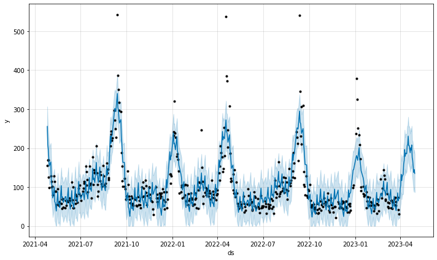

# Adding Seasonality to your Prophet Forecast



Getting a forecast right is really hard. Seasonality affect sales to call center and has proven to be a major challenge for businesses. 

One of the challenges in call center forecasting is accounting for seasonality. Seasonality refers to regular patterns in the data that repeat over a fixed time period, such as daily, weekly, or monthly. Examples of seasonal patterns in call center volume might include higher call volume during certain times of the day or week, or increased call volume during certain times of the year (e.g. around holidays).

Luckily Facebook Prophet has seasonality components that find seasonality in your data and is relatively easy to use.

# What is Prophet ? 

Prophet makes it easy to incorporate seasonality into your forecasts. One approach is to specify seasonalities in the model using the 'add_seasonality' function. This function allows you to specify the name of the seasonal component, the period of the seasonality (e.g. daily, weekly, monthly), and the Fourier order (which controls the flexibility of the seasonality). 

## The Code

Let's say you are working with call center volume data from Kaggle and want to incorporate a daily seasonality into your Prophet model. Here's how you might do it:
```python
import pandas as pd
from fbprophet import Prophet

# Load data
data = pd.read_csv('call_center_data.csv')

# Create Prophet model
model = Prophet()

# Add daily seasonality
model.add_seasonality(name='daily', period=1, fourier_order=10)

# Fit model to data
model.fit(data)

# Make predictions
future_dates = model.make_future_dataframe(periods=30)
forecast = model.predict(future_dates)

# Plot forecast
model.plot(forecast)

```
Adding seasonality to your Prophet model can help improve the accuracy of your volume forecasts, particularly if there are regular patterns in the data that repeat over time. By using the 'add_seasonality' function in Prophet, you can make forecasting much easier for your data science teams. 
